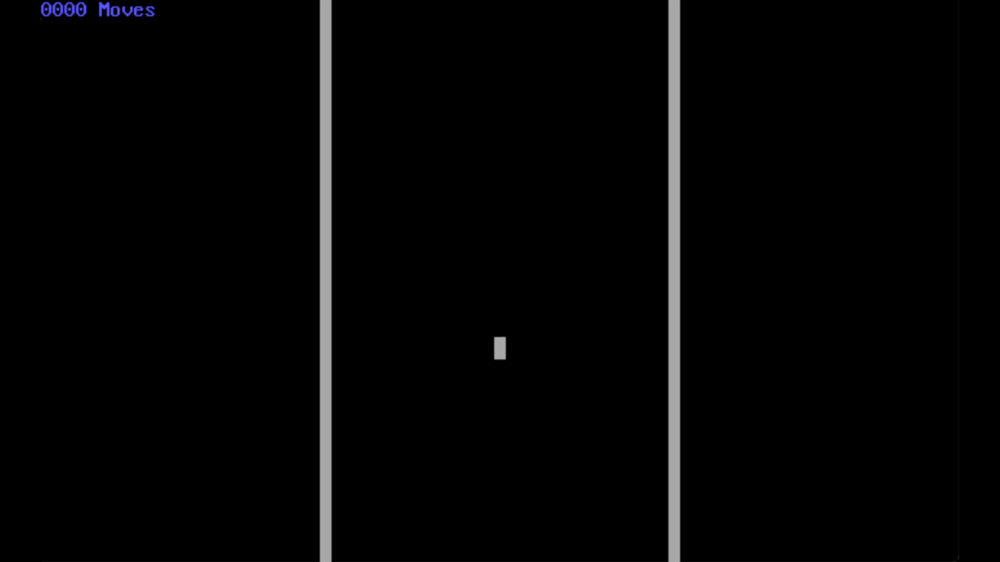

# Tetris

[](https://github.com/vshymanskyy/StandWithUkraine/blob/main/docs/README.md)

## General Information

A simplified implementation of Tetris game written in TASM(Trubo Assembly).

## Setup

First of all it's required to build objective file with the following command
```shell
tasm main.asm
```

After that it's required to perform linking operation with the following command:
```shell
tlink /n /v main.obj
```

Finally, the executable is ready and can be run with the following command:
```shell
main
```

## Use case

